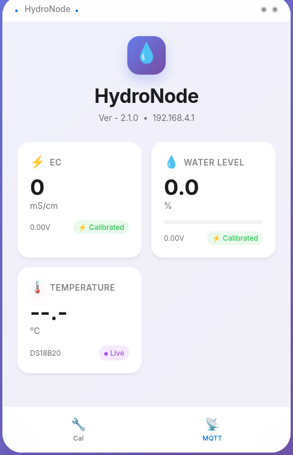

# HydroNode 🌱

HydroNode is an ESP32-C3 based smart hydroponic monitoring system
designed for real-time sensing, web visualization, and Home Assistant
integration via MQTT.

This project integrates: - 🌡 DS18B20 Temperature Sensor - 💧 Submersible
Water Level Sensor (Analog) - ⚡ EC (Electrical Conductivity) Sensor
(0--5V transmitter) - 📺 20x4 I2C LCD Display - 🌐 Built-in Async Web UI
(LittleFS hosted) - 📡 Optional MQTT support for Home Assistant


------------------------------------------------------------------------

# 📦 Features

## ✅ Sensor Monitoring

-   Temperature monitoring via DS18B20 (OneWire)
-   Water level percentage calculation (analog voltage calibration)
-   EC value monitoring from 0--5V transmitter (requires voltage divider
    for ESP32 ADC)

## ✅ Web Interface

-   Web-UI security (Login Authentic Requires)
-   Real-time sensor dashboard
-   WiFi configuration (AP fallback mode)
-   MQTT configuration panel
-   JSON API endpoints for integration

## ✅ MQTT Integration

-   Publish sensor data to custom topics
-   Compatible with Home Assistant
-   Enable/disable MQTT via Web UI

## ✅ LCD Interface (20x4)

Display layout:

Line 0: Title + WiFi/MQTT status\
Line 1: EC (mS/cm)\
Line 2: Water Level (%)\
Line 3: IP Address or AP status

## ✅ Hardware Target

-   Board: ESP32-C3 SuperMini / ESP32-C3-DevKitM-1
-   Flash: 4MB
-   Filesystem: LittleFS

------------------------------------------------------------------------

# 🗂 Project Structure

    hydroNode/
    │
    ├── src/
    │   └── main.cpp              # Main firmware
    │
    ├── data/
    │   └── www/
    │       ├── index.html        # Main dashboard UI
    │       ├── style.css         # Styling
    │       └── app.js            # Frontend logic
    │
    ├── include/                  # Header files (if any)
    ├── lib/                      # Local libraries (if any)
    ├── partitions.csv            # Custom partition layout
    ├── platformio.ini            # PlatformIO configuration
    └── README.md

------------------------------------------------------------------------

# ⚙️ PlatformIO Configuration

Environment: esp32c3

Key configuration: - Framework: Arduino - Filesystem: LittleFS - Flash
size: 4MB - Flash mode: DIO

Required libraries:

-   ArduinoJson
-   PubSubClient
-   ESPAsyncWebServer
-   AsyncTCP
-   LiquidCrystal_I2C
-   OneWire
-   DallasTemperature

------------------------------------------------------------------------

# 🔌 Hardware Wiring

## 1️⃣ DS18B20

-   VCC → 3.3V
-   GND → GND
-   DATA → GPIO (with 4.7kΩ pull-up to 3.3V)

## 2️⃣ Water Level Sensor (0--5V Output)

⚠ If sensor outputs 5V, use voltage divider (e.g., 47kΩ / 47kΩ)

-   Signal → ADC pin (after divider)
-   VCC → According to sensor spec
-   GND → Common ground

## 3️⃣ EC Transmitter (0--5V)

-   V+ → 12V supply

-   V- → GND

-   -   (Signal) → ADC pin via voltage divider

-   -   (Signal GND) → GND

------------------------------------------------------------------------

# 🌐 Web UI Access

On first boot: - Device creates AP mode - Connect to ESP32 AP -
Configure WiFi credentials - Device reboots and connects to your router

Access dashboard via: http://DEVICE_IP/ - (find your device ip on LCD Display)
- Web-UI Login
    - Username: admin
    - Password: hydronode
    - ** Web-UI credential can be changed via main.cpp  



------------------------------------------------------------------------

# 📡 MQTT Setup (Home Assistant)

1.  Enable MQTT in Web UI.
2.  Enter:
    -   Broker IP
    -   Port (default 1883)
    -   Username & Password
3.  Save and reboot.

Example MQTT topics:
```
    hydronode/temperature
    hydronode/ec
    hydronode/waterlevel
```
In Home Assistant, create MQTT sensors manually by setting up configuration.yaml and paste this:

```
mqtt:
  sensor:

    - name: "HydroNode Temperature"
      state_topic: "hydronode/status"
      unit_of_measurement: "°C"
      device_class: temperature
      value_template: "{{ value_json.temperature }}"

    - name: "HydroNode EC"
      state_topic: "hydronode/status"
      unit_of_measurement: "mS/cm"
      value_template: "{{ value_json.ec }}"

    - name: "HydroNode Water Level"
      state_topic: "hydronode/status"
      unit_of_measurement: "%"
      value_template: "{{ value_json.water }}"
```
------------------------------------------------------------------------

# 🛠 Build & Upload

## Install PlatformIO

Use VSCode with PlatformIO extension.

## Build Firmware

    pio run

## Upload Firmware

    pio run --target upload

## Upload Web UI (LittleFS)

    pio run --target uploadfs

------------------------------------------------------------------------

# 🧪 API Endpoints

  Endpoint        Description
  --------------- ---------------
  ```
  /api/status     System status
  /api/ec         EC reading
  /api/water      Water level
  /api/temp       Temperature
  /api/settings   Configuration
  ```

------------------------------------------------------------------------

# 🧠 Calibration Notes

## EC Calibration

Adjust conversion factor in firmware based on standard EC solution
(e.g., 1.413 mS/cm).

## Water Level Calibration

Set: - Voltage at Empty - Voltage at Full

Then map percentage accordingly.


------------------------------------------------------------------------

# 📜 License

MIT License

You are free to modify and distribute this project.

------------------------------------------------------------------------

# 👨‍🔬 Author

Dr. Zainal Abidin Arsat\
Universiti Malaysia Perlis (UniMAP)\
Faculty of Mechanical Engineering & AgroTech

Smart Agriculture \| IoT \| AI Integration

------------------------------------------------------------------------

HydroNode is part of the broader precision agriculture ecosystem
focusing on fertigation automation and intelligent monitoring systems.
